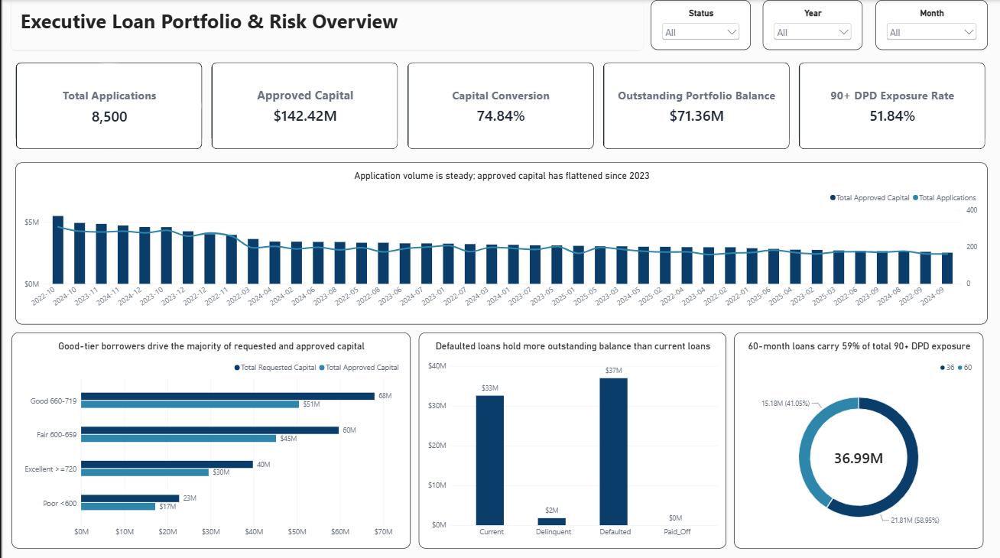
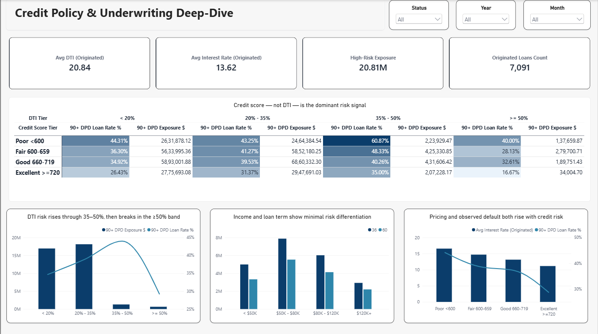
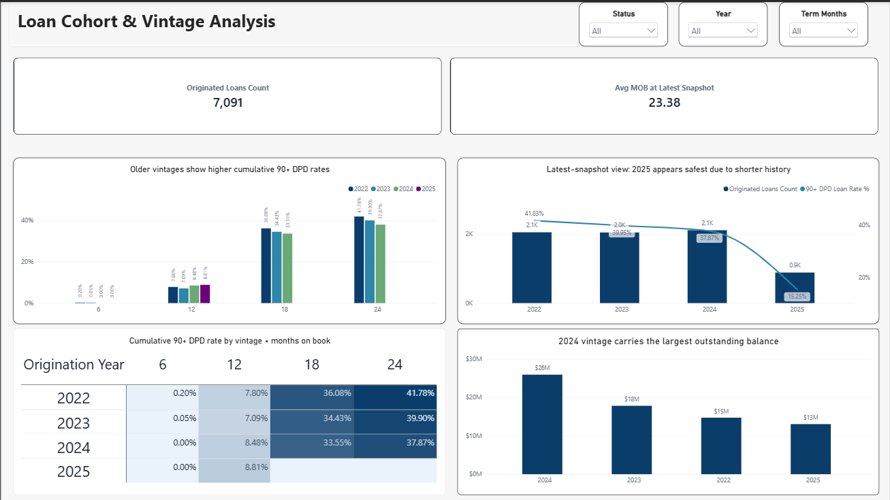

# Fintech Credit Risk & Portfolio Analytics

An end-to-end analytics project on a synthetic lending portfolio — from raw CSV ingestion through a Python/SQL Server pipeline into a three-page Power BI dashboard covering portfolio health, underwriting effectiveness, and vintage cohort behavior.

**Stack:** Python (pandas) · SQL Server · SSMS · Power BI · DAX · Excel

## Preview

| Portfolio Overview | Underwriting Deep-Dive | Vintage Analysis |
|---|---|---|
|  |  |  |

## What this project does

The project simulates a lending business with 4,000 borrowers, 8,500 loan applications, and 165,778 monthly loan performance snapshots. It walks through the full analytics workflow a credit risk team would use to answer three questions:

1. **What is the state of the loan book today?** — Portfolio-level KPIs and risk distribution
2. **Which underwriting attributes actually predict default?** — Cross-sectional analysis of DTI, credit score, income, and loan term
3. **Are newer loan cohorts performing worse — or are they simply less seasoned?** — Vintage and Months-On-Book (MOB) cohort analysis

## Pipeline

raw CSVs → Python (pandas) → SQL Server → Power BI → Executive Memo
clean + audit model + load DAX measures findings

**Python layer** — `Finance_pipeline.py`

- Reads raw CSVs
- Imputes missing `AnnualIncome` (median by `EmploymentLengthYears`)
- Caps `DebtToIncomeRatio` at 55 (project-defined upper limit)
- Runs data-quality checks and audits deltas
- Appends only new records to SQL Server (incremental load)
- Logs execution and DQ results

**SQL Server layer** — `finance.sql`

- Warehouse-style schema: two fact tables + one dimension
- Primary keys, foreign keys, and check constraints enforced
- Analysis queries for all findings below

**Power BI layer** — `finance.pbix`

- Three-page report: Overview · Credit Policy Deep-Dive · Vintage Analysis
- Custom DAX measures for latest-snapshot exposure, cumulative default by MOB, and policy-defined high-risk segmentation
- Findings-style chart titles (states the conclusion, not the axes)

## Key findings

### Portfolio health (Page 1)

- **$190.29M requested** → **$142.42M approved** (74.84% capital conversion)
- **$71.36M** outstanding portfolio balance
- **51.84%** of outstanding balance sits at 90+ Days Past Due
- 60-month loans carry **58.95%** of total 90+ DPD exposure

### Underwriting effectiveness (Page 2)

- **Credit score is the dominant risk signal.** 90+ DPD loan rate falls from 44.2% (Poor <600) to 28.7% (Excellent ≥720)
- **DTI adds modest signal** and breaks in the ≥50% band — likely a thin-sample artifact
- **Income and loan term show minimal differentiation** — checking them adds little predictive value at this data scale
- **Pricing tracks risk directionally** — but this dataset does not contain LGD, recovery, funding cost, or capital cost, so pricing adequacy cannot be established from it

### Vintage analysis (Page 3)

- Latest-snapshot view makes 2025 look safest at 15.25% — **that is a seasoning artifact**, not evidence of improved underwriting
- After adjusting for Months-On-Book, **older vintages show slightly higher cumulative 90+ DPD rates** than newer ones (2022: 41.78% by MOB24 vs. 2024: 37.87%)
- **No evidence of underwriting deterioration** in this portfolio after controlling for seasoning
- 2025 is right-censored — it hasn't reached MOB18 or MOB24 yet, so its long-run performance cannot be evaluated

## A methodology note — survivorship bias

My first version of the vintage analysis measured 90+ DPD rate at each MOB checkpoint as *"of loans with a snapshot at MOB N, what % are at 90+ DPD?"* This produced a spurious result: the rate collapsed from 5% at MOB18 to 0.2% at MOB24 across every cohort.

The cause: in this dataset, once a loan hits 90+ DPD, its performance snapshots stop. So defaulted loans vanish from the denominator at later checkpoints. The metric was effectively measuring *"of the survivors, what % are currently defaulting"* — a question that is mathematically guaranteed to fall toward zero over time.

**The fix:** keep the full original cohort as the denominator and count a loan as defaulted from its first 90+ DPD month onward (cumulative). Add explicit right-censoring handling — return NULL when a vintage hasn't been observed far enough to answer a given MOB checkpoint.

The corrected query is in `finance.sql`. The full explanation and side-by-side comparison is documented in the project notebook.

## Repository structure

├── Finance_pipeline.py Python ETL pipeline (clean, audit, incremental load)
├── finance.sql SQL Server schema + analysis queries
├── finance.ipynb Data audit, EDA, and methodology notebook
├── finance.pbix Power BI dashboard (3 pages)
├── images/ Dashboard screenshots
└── raw/ Source CSVs (not in repo — see .gitignore)

## How to reproduce

1. Clone the repo
2. Place source CSVs into `raw/` (contact me if you need the synthetic data generator)
3. Configure a SQL Server instance and update the connection string in `Finance_pipeline.py`
4. Run `Finance_pipeline.py` to clean and load the data
5. Open `finance.pbix` in Power BI Desktop and refresh

## Limitations

- **Synthetic data.** Patterns here are designed, not observed. The findings illustrate methodology — they are not evidence about any real lending portfolio.
- **No expected loss modeling.** LGD, recovery, funding cost, and capital cost are out of scope — this project does not attempt to prove pricing adequacy.
- **No temporal policy metadata.** The dataset has no record of when underwriting rules changed, so vintage patterns cannot be causally attributed to policy shifts.
- **90+ DPD as operational default.** This is the project's defined threshold, not a universal industry standard.

## Contact

**Kiran M K**
[LinkedIn](https://linkedin.com/in/kiran-mk-data) · [GitHub](https://github.com/kiranmk12)

---

*Project completed as a portfolio piece covering SQL analytics, Python ETL, and Power BI reporting. All analysis validated against SQL benchmarks before visualization.*
